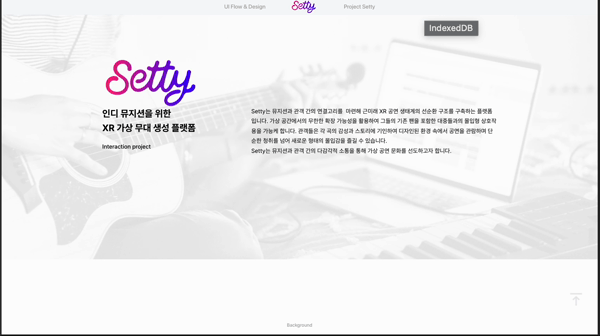
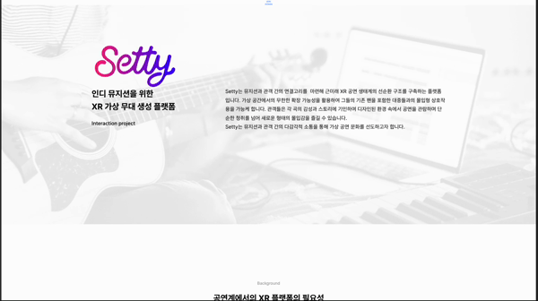
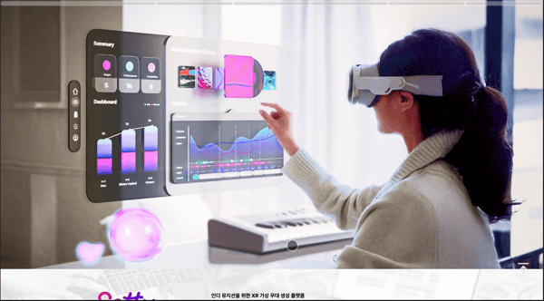

# 🎨 Setty_for_indie

  
2024 홍익대학교 산업디자인학과 졸업 전시회 for Setty

  <h3>📌<a href="https://yoonmins.github.io/Setty_for_indie/" target="_blank"> Project :  Setty Website</a></h3>
   

---

## 🎯 프로젝트 소개
**Setty_for_indie** 는 홍익대학교 산업디자인학과 졸업 전시회(2024)를 위해 제작된 웹사이트입니다.  
짧은 제작 기간(2일)에도 불구하고 빠르게 MVP를 구현하였으며, 이후 요구사항 변경을 반영하여 **원페이지 반응형 웹사이트**로 발전시켰습니다.

---

## 🗓️ 프로젝트 수행 기간
- **2024.11.24 ~ 2024.11.25**

---

## 👨‍💻 개발 스택

  
  **FrontEnd**  
  
  
  

  **Infra & Deploy**  
  
  

  **Tool**  
  
  

---

## 🚀 버전 히스토리

### 📌 ver.1.0.0 (2024.11.24)
- **Bootstrap 기반 UHD 웹사이트 (5120 × 2880) 제작**
- 메인 화면 구성 완료 (MVP)
- 제작 기간 : 2일  

---

### 📌 ver.1.1.0 (2024.11.25)
- 요구사항 변경 반영
- **원페이지 반응형 웹사이트 제작** (모바일, 웹, 태블릿 지원)  

---

### 📌 ver.1.1.1 (2024.11.25)
- 상단 네비게이션 바 개선 → 원하는 구간으로 이동 가능
- 최종 디자인 반영 및 개발 완료  

---

## ✨ 프로젝트 의의
- 짧은 시간 내에 **디자인 전시회를 위한 맞춤형 웹사이트**를 개발
- **빠른 MVP 배포 → 요구사항 반영 → 완성도 있는 최종본**으로 발전
- 학과 전시회의 디지털 아카이빙 및 홍보 채널로 활용
